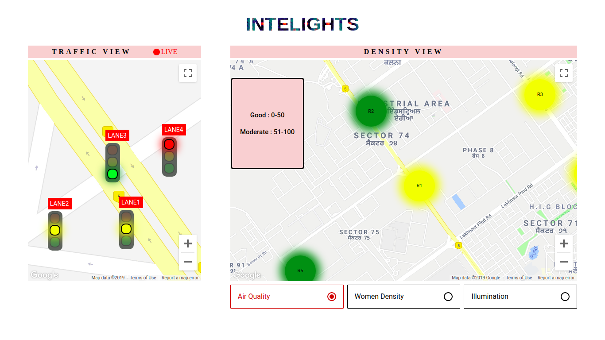
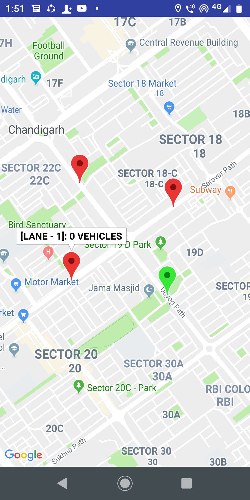

# Team Details
Team Name: Dexter's Lab
Members:
1.Rahul Goyal
2.Karamdeep singh Bami
3.Hardeep singh
4.Karanveer singh

# Intelights
Intelights proposes a 360degree solution to curb the rising problem of traffic congestion.One of the major reasons for traffic congestion is the inefficient working of traffic signal timers installed at intersections. Presently the timers of traffic lights display a preset value which leads to waste of time. There are scenarios in which a green light of “20 seconds” is displayed but there is no vehicle present at that particular intersection. To overcome this, “Intelights” proposes an "Intelligent Traffic Timer Control" which uses dynamic signal control technology to adjust the timers of red, yellow and green lights according to the traffic density at an intersection. Intelights can use the existing CCTV cameras to gather live traffic video feed. Then, it automatically evaluates the traffic density using Artificial intelligence (image processing) and sets the signal timers accordingly. This process is repeated for every cycle of traffic lights to keep traffic flowing smoothly.

Intelights also monitors the traffic and divides it into sub categories providing a dataset with a very high resolution and accuracy.Using the same, it can monitor the intersection wise issues and will help us provide a safer city.

# PPT
https://docs.google.com/presentation/d/1CsWHqoV6kbXPc6gLoVTKvR7uSMqUpcHWWQ8k-DNEZ6w/edit?usp=sharing

# Research paper linking the wastage of fuel
https://www.academia.edu/2527399/ESTIMATION_OF_FUEL_LOSS_DURING_IDLING_OF_VEHICLES_AT_SIGNALISED_INTERSECTIONS_IN_DELHI

# Web Dashboard prototype
http://intelights.herokuapp.com/

# Android app source code
https://github.com/rahulgoyal911/unite/edit/master/README.md

# Web Portal Screenshot

# Android app screenshot

